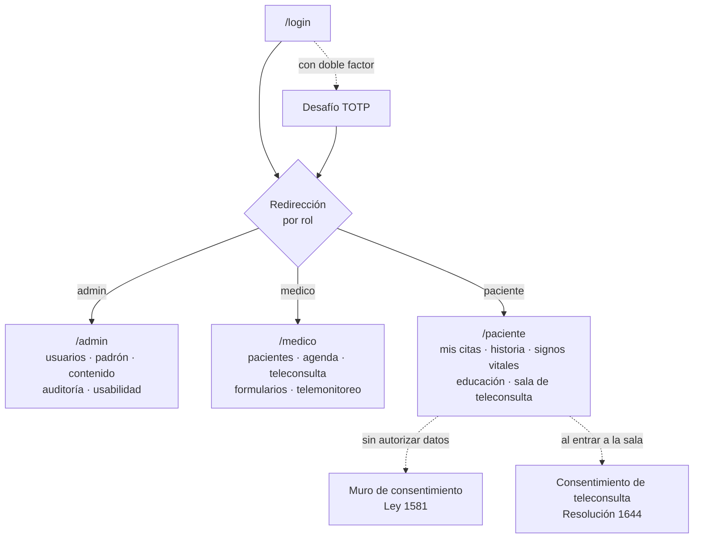
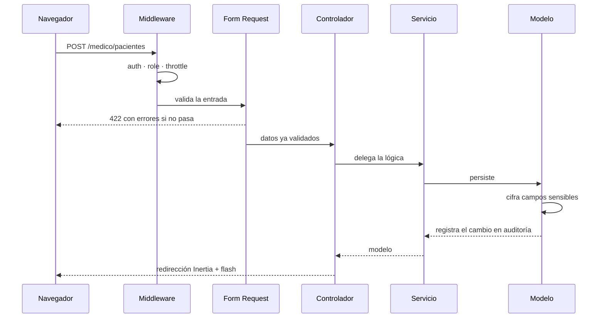
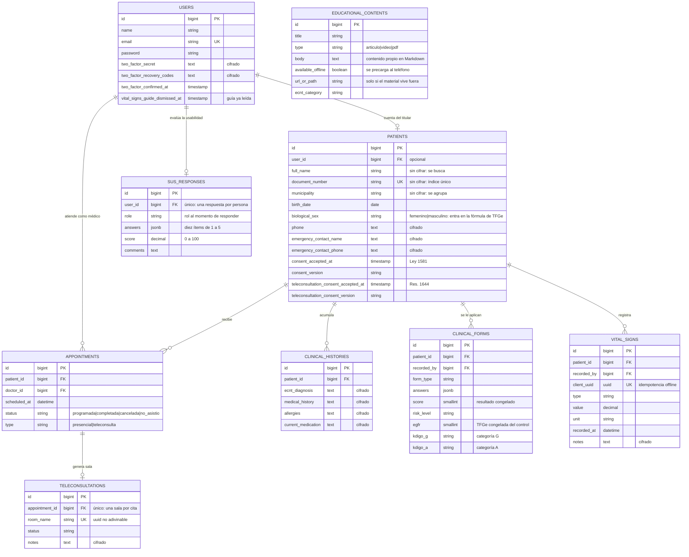
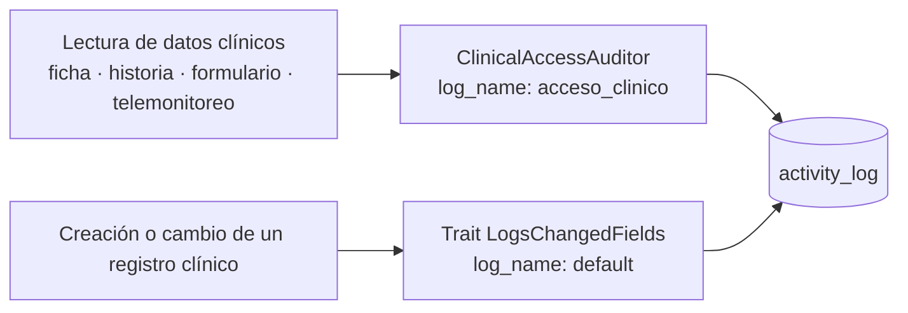
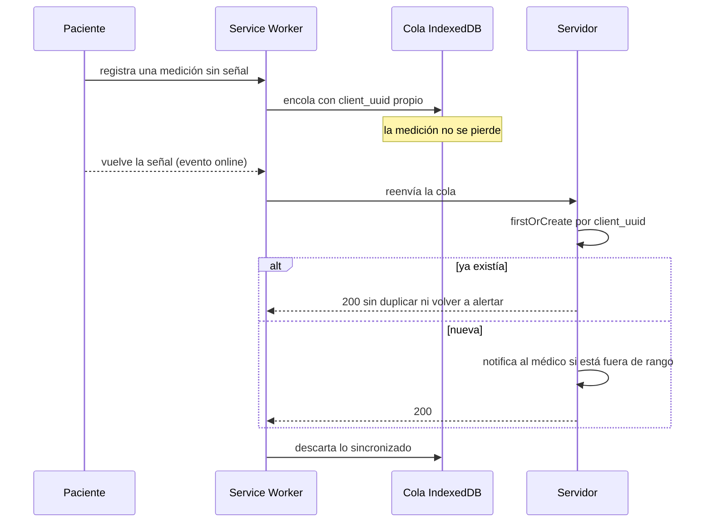
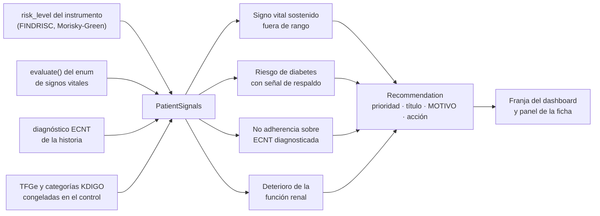

# Arquitectura — IPS NefroChocó

Documento técnico de la plataforma de telemedicina para el seguimiento de enfermedades crónicas no transmisibles (ECNT) en el departamento del Chocó.

- [Visión general](#visión-general)
- [Zonas y roles](#zonas-y-roles)
- [Flujo de una petición](#flujo-de-una-petición)
- [Modelo de datos](#modelo-de-datos)
- [Autorización](#autorización)
- [Cifrado en reposo y auditoría](#cifrado-en-reposo-y-auditoría)
- [Modo sin conexión](#modo-sin-conexión)
- [Función renal: TFGe y KDIGO](#función-renal-tfge-y-kdigo)
- [Apoyo a decisiones clínicas](#apoyo-a-decisiones-clínicas)
- [Decisiones de diseño y sus motivos](#decisiones-de-diseño-y-sus-motivos)

---

## Visión general

Monolito Laravel con frontend React servido por Inertia. **No hay API REST separada**: los controladores devuelven respuestas de Inertia y React recibe las propiedades ya resueltas. Esa decisión elimina una capa entera de serialización, autenticación de API y versionado, que en un proyecto de un solo cliente institucional solo habría sumado superficie que mantener.

| Capa | Tecnología |
|---|---|
| Backend | Laravel 12 (PHP ^8.2) |
| Base de datos | PostgreSQL (único motor soportado) |
| Frontend | React 19 + TypeScript vía Inertia.js 2 |
| Estilos | Tailwind CSS 4 con sistema de tokens propio |
| Roles | spatie/laravel-permission |
| Auditoría | spatie/laravel-activitylog + trait propio |
| Video | Jitsi Meet External API |
| Segundo factor | TOTP (pragmarx/google2fa + bacon/bacon-qr-code) |
| Pruebas | Pest |

## Zonas y roles



Cada zona es un grupo de rutas con su propio middleware: `auth`, `role:<rol>` y un límite de peticiones por usuario. La zona del paciente añade `EnsureDataConsent`.

## Flujo de una petición



Los controladores son delgados a propósito: reciben, autorizan, delegan y responden. La lógica vive en `app/Services`, y toda la validación en `app/Http/Requests`.

## Modelo de datos



Los índices de consulta están en una migración aparte. PostgreSQL no indexa claves foráneas por su cuenta: sin ellos, cada panel resolvía recorriendo la tabla completa.

## Autorización

El middleware de rol responde *qué rol tiene* el usuario; las policies responden *si el recurso es suyo*. Hacen falta las dos.

| Recurso | admin | medico | paciente |
|---|---|---|---|
| Padrón de pacientes (ver, crear, editar) | ✅ | ✅ institucional | ❌ |
| Eliminar una ficha de paciente | ✅ | ❌ | ❌ |
| Agenda: reprogramar, cancelar, eliminar | ❌ | ✅ solo sus citas | ❌ |
| Abrir sala y cerrar teleconsulta con notas | ❌ | ✅ solo sus citas | ❌ |
| Entrar a la sala como paciente | ❌ | ❌ | ✅ solo su cita |
| Historia clínica | ✅ | ✅ | ✅ solo la suya |
| Registro de auditoría | ✅ | ❌ | ❌ |

**El padrón es institucional y la agenda es personal.** El programa de ECNT rota profesionales y cubre municipios dispersos, así que cualquier médico de la IPS atiende a cualquier persona inscrita. Pero una cita es el compromiso de un profesional concreto: dejar que otro la mueva rompe la agenda ajena y la trazabilidad de quién decidió qué.

## Cifrado en reposo y auditoría

Se cifra con el cast `encrypted` de Laravel todo el contenido clínico y los datos de contacto. **No se cifran** `full_name`, `document_number` ni `municipality`: cada cifrado usa un vector de inicialización distinto, así que dos valores iguales producen textos distintos y se romperían la búsqueda de pacientes, el índice único del documento y el reporte por municipio.

La auditoría cubre dos cosas distintas que la Ley 1581 exige por separado:



El trait registra **los nombres de los campos tocados, nunca sus valores**. `activity_log.properties` es JSON sin cifrar: copiar ahí un diagnóstico anularía el cifrado de la tabla de origen. Con el nombre del campo alcanza para demostrar quién modificó qué, y el contenido vigente se consulta en la fila, cuya lectura queda auditada aparte.

**Qué lecturas se registran.** No solo la historia clínica: también la ficha del paciente —que arrastra historias, formularios y mediciones— el detalle de un formulario clínico y el telemonitoreo, que expone la serie completa de signos vitales. Cada registro guarda el paciente, el tipo de recurso y la IP.

**Recargas parciales de Inertia.** Se registran igual que una lectura completa, y se marcan aparte con `parcial: true`. Una recarga parcial devuelve las props que se le piden, así que el dato clínico vuelve a viajar al cliente: no registrarla dejaría un punto ciego alcanzable con solo forzar recargas. La marca permite distinguir en la auditoría un refresco de una consulta nueva.

## Modo sin conexión



La clave de idempotencia la genera el dispositivo. Si el servidor guardó pero la respuesta se perdió antes de llegar, el reintento no duplica la medición **ni vuelve a alertar** al médico por algo que ya revisó. Un 422 se descarta en vez de reintentarse por siempre.

**La cola está aislada por cuenta.** IndexedDB vive en el navegador, no en el usuario: en un teléfono compartido entre pacientes de la misma familia, sin aislar la cola lo que el paciente A registró sin señal terminaría sincronizado en la historia del paciente B al iniciar sesión. Por eso cada `PendingRequest` guarda el `ownerId` (el id del usuario autenticado al encolar, tomado de las props compartidas de Inertia), y tanto el contador de pendientes como `flush()` solo consideran las entradas de quien tiene sesión iniciada — lo de otras cuentas se ignora, **nunca se borra**: queda esperando a que su dueño vuelva a entrar. Un 401, 403 o 419 al reenviar se trata igual que no tener red: la sesión no sirvió para enviar *ahora*, no que el dato esté mal, así que se conserva en vez de descartarse como el 422.

Las entradas guardadas antes de este cambio no tenían `ownerId`. Adivinar el dueño —por ejemplo, asignárselo a quien inicie sesión primero— es exactamente el bug que se corrige, así que la migración de `DB_VERSION` 1 a 2 las marca con `ownerId: null` en vez de descartarlas: las mediciones clínicas no se pueden perder, y un `null` las deja fuera del conteo y del `flush()` de cualquier cuenta para siempre, inertes pero intactas por si alguna vez hace falta revisarlas a mano.

**Al cerrar sesión con pendientes propios**, se avisa antes de salir —sin bloquear el cierre de sesión— con cuántas mediciones quedan guardadas en el teléfono y que se enviarán solas cuando su dueño vuelva a entrar con señal.

**El material educativo va en la dirección contraria**: no es algo que el paciente envía, sino algo que necesita tener encima antes de quedarse sin señal. Por eso el contenido se escribe dentro de la plataforma en vez de enlazarse a otro sitio —el service worker solo intercepta el mismo origen, así que un enlace externo nunca se podría guardar— y la pantalla de Educación le pide al service worker que descargue el material marcado como disponible sin conexión en cuanto se abre, aprovechando que en ese momento sí hay red.

Ese material vive en una caché aparte de la del resto de páginas, pero **se borra igual al cerrar sesión**. No porque el contenido sea sensible, sino porque cada página de Inertia lleva las props compartidas y entre ellas el nombre de quien la vio: mientras el material viaje dentro de una página completa, conservarlo dejaría ese nombre accesible en un teléfono compartido. Desacoplarlo —servir el cuerpo del artículo por un endpoint sin datos personales— es lo que permitiría que sobreviviera al cierre de sesión.

## Función renal: TFGe y KDIGO

El programa gira alrededor de la enfermedad renal crónica, que avanza sin síntomas: por eso cada control renal deja una cifra comparable en vez de una impresión clínica.

`EgfrCalculator` es un servicio puro —no conoce Eloquent ni la base de datos— que recibe creatinina sérica, edad y sexo biológico y devuelve la **tasa de filtración glomerular estimada** con la ecuación **CKD-EPI 2021 de creatinina, sin coeficiente de raza**:

```
TFGe = 142 × min(Scr/κ, 1)^α × max(Scr/κ, 1)^−1.200 × 0.9938^edad × 1.012 [si es mujer]
κ = 0.7 (femenino) / 0.9 (masculino), creatinina en mg/dL
α = −0.241 (femenino) / −0.302 (masculino)
```

La fuente primaria es Inker LA et al., *New Creatinine- and Cystatin C–Based Equations to Estimate GFR without Race*, N Engl J Med 2021; los coeficientes se contrastaron además contra la calculadora de la National Kidney Foundation y la del NIDDK.

**Por qué la ficha pide sexo biológico.** La ecuación usa κ y α distintos según el sexo, así que sin ese dato no hay TFGe. Es un campo de sexo biológico y no de identidad de género: admite solo los dos valores que la fórmula contempla, y no se infiere de ningún otro dato de la ficha. Las fichas anteriores a que el campo existiera lo tienen vacío y el control renal no se puede calcular hasta completarlo.

**El resultado se redondea a entero** porque así lo reportan la calculadora oficial y los laboratorios. Mostrar 89,7 y clasificar G2 mientras el laboratorio informa 90 le daría al profesional una contradicción sin explicación.

Con la TFGe y la relación albúmina/creatinina se asignan las categorías **G** y **A** de KDIGO, y las tres cifras quedan **congeladas en el formulario** (`clinical_forms.egfr`, `kdigo_g`, `kdigo_a`). Congelarlas es lo que permite comparar controles: recalcular con la fórmula de hoy reescribiría la historia de ayer.

## Apoyo a decisiones clínicas

No es analítica predictiva ni aprendizaje automático: es un motor de reglas escritas y explicables.



**La regla renal tiene dos ramas distintas.** Una mira dónde está el paciente hoy: una categoría G4/G5 o una albuminuria A3 ameritan valoración especializada sin esperar a ver una tendencia. La otra mira hacia dónde va: una caída sostenida de la TFGe entre controles importa aunque las cifras todavía no sean alarmantes. Ninguna de las dos recalcula la TFGe, usan la que quedó congelada con cada formulario.

Ninguna regla recalcula riesgo: leen señales que el sistema ya calculó. Los umbrales clínicos salen de los instrumentos validados del catálogo y de los rangos del enum; `config/clinical_support.php` solo define umbrales operativos (cuántas lecturas seguidas cuentan como sostenido) y está marcado como pendiente de validación clínica.

Cada recomendación **debe** decir qué regla se disparó y con qué dato. Sin eso el profesional no puede juzgar si aplica a la persona que tiene enfrente.

## Decisiones de diseño y sus motivos

| Decisión | Motivo |
|---|---|
| Inertia en vez de API REST | Un solo cliente institucional; una API separada solo habría sumado capas que mantener |
| Gráficas en SVG propio, sin librería | El peso importa más que las animaciones cuando la red es intermitente |
| Service worker escrito a mano | La estrategia de caché es una decisión clínica, no solo de rendimiento: vale más una historia de hace cinco minutos que una pantalla de error, pero nunca vale mostrar datos a quien ya cerró sesión |
| Notificaciones solo por base de datos | En zonas rurales un correo puede tardar horas; el aviso vive donde el profesional sí entra |
| Instrumentos clínicos en código, no en BD | Son instrumentos validados que cambian con evidencia, no configuración de cliente; versionarlos en git deja trazabilidad de qué se aplicó y cuándo |
| TOTP en vez de SMS para el segundo factor | La aplicación genera el código sin red; un SMS depende de la misma cobertura que falla |
| Consentimiento de teleconsulta al entrar a la sala | Es una autorización sobre la modalidad de atención: tiene sentido pedirla cuando se va a usar, con la cita a la vista |
| Sin Content-Security-Policy todavía | La teleconsulta carga hoy un script de `meet.jit.si` y la tipografía viene de un CDN; una CSP mal ajustada rompe la videollamada en silencio. Se define junto con el autoalojamiento de Jitsi, que sí es parte del proyecto: con el video en origen propio la política deja de tener que permitir un tercero |
| Cuerpo del material educativo en Markdown, no en HTML | El contenido lo escribe el personal desde el panel y lo lee todo paciente. Se convierte con el HTML crudo descartado, así que el panel no puede inyectar `<script>` en la pantalla de nadie; Markdown alcanza para títulos, negritas y listas |
| Una sola respuesta de usabilidad por persona | El promedio SUS debe reflejar a cuánta gente se le preguntó, no cuántas veces respondió cada quien. El reporte agrega por rol y nunca muestra nombres: quien dice que la plataforma le resultó incómoda no debería quedar señalado ante quien la administra |
